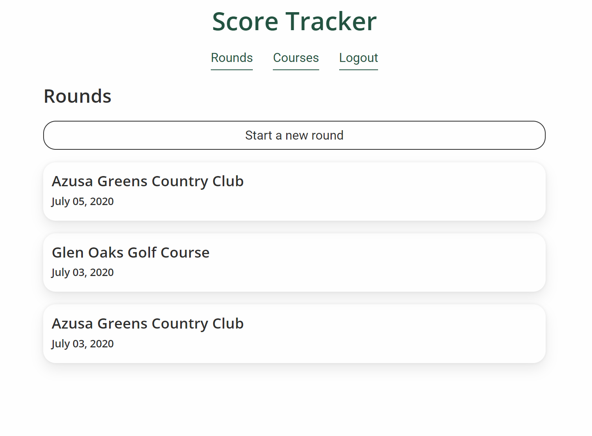
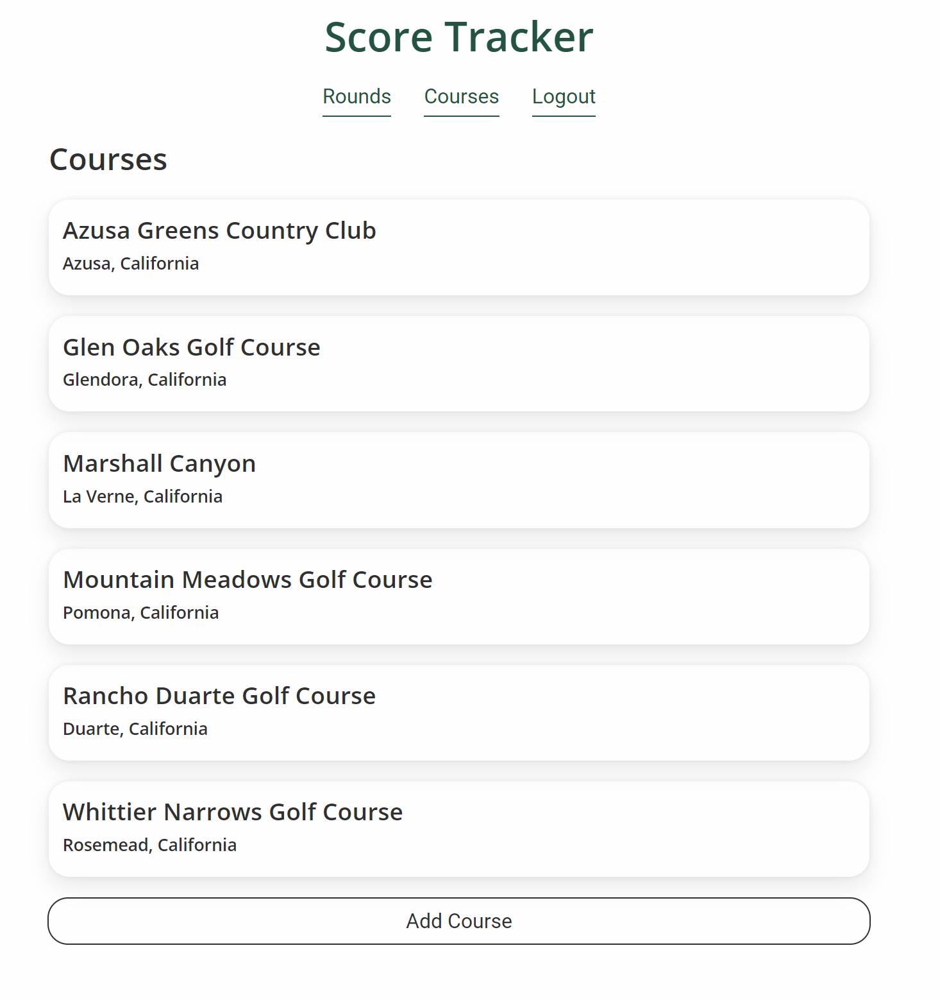
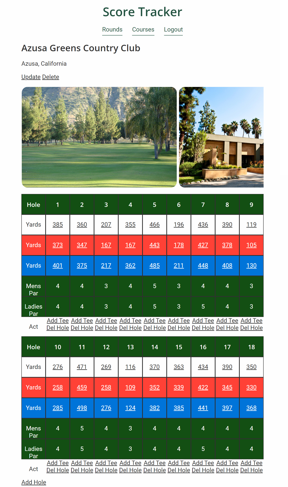
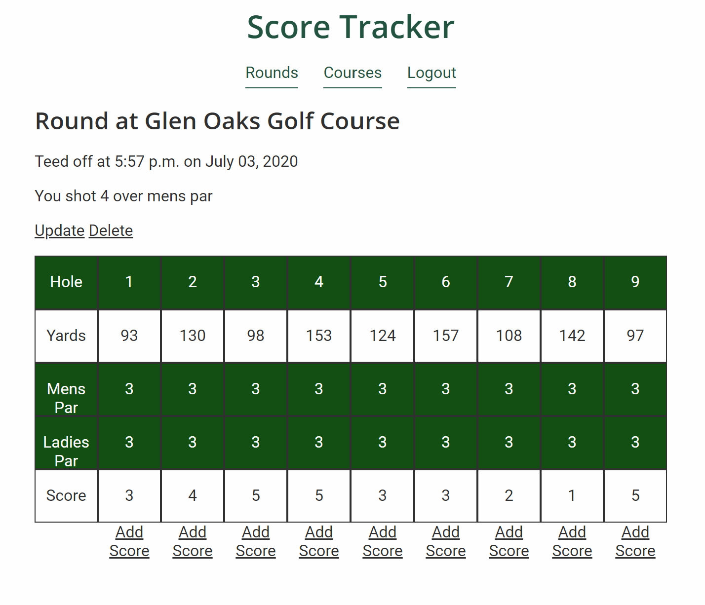

# Golf Tracking Site

> Track the progress on your goal to sink more birdies!

## Demo
[golf.grimechristopher.com](http://golf.grimechristopher.com)

Please feel free to test out the application by adding your favorite golf courses to the database or entering some data about your latest round.

## Description

Golf Tracker is a website that allows anyone to create and view score cards for any golf course. Loggged in users are able to track the score of their rounds as well as add golf courses to the database. Users are also able to add and edit holes, tees, and pictures to golf courses in the database. 

I used Django to build this application because I wanted to learn a new framework and I knew I wanted to do something that involved golf. I am a big golf fan and love to play. I decided designing a application and database to track golf scores would be a good challenge. 

I learned how to use class-based views to implement CRUD operations, display dynamic data using the Django templating system, and modifying the authentication sytem by creating a custom user class. Working on this project improved my database design and Python skills. 

## Features

- Create and view scorecards for golf courses
- Add and view pictures of golf courses
- Track golf scores of rounds played
- User authentication utilizing custom user types in Django

## Technologies

- Django version 2.2.4
- Python version 3.7.2
- HTML
- CSS
- Sqlite version 2.6.0

## Screenshots

## Future Development

I have many planned features in mind for continuing the development of this project:
- Display the correct over/under par for men's or women's tees
- Track the best scores for each course
- Add data so users can see their best/worst/average scores
- Add ability to upload pictures for rounds
- Add more golfers to a round and compare scores
- Add a comments or tips section to the courses
- Add pictures to the courses list

---

[grimechristopher.com](https://grimechristopher.com)  
[chris@grimechristopher.com](mailto:chris@grimechristopher.com)  
[linkedin/in/grimechristopher](https://linkedin/in/grimechristopher)  
